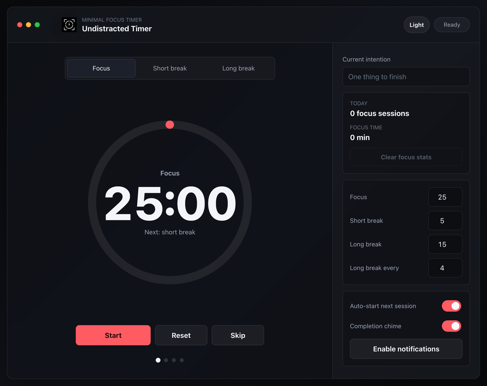

# Undistracted Timer

A quiet interval timer for focused work sessions, intentional breaks, and
gentle ambient sound. Runs in any modern browser, with a native macOS desktop
app via Tauri.

The shared web app lives in `web/`. The macOS desktop wrapper lives in
`src-tauri/`.

## Preview



## Features

- Focus, short break, and long break modes
- Precise timer that stays accurate when the tab is backgrounded
- Configurable durations and long-break cadence
- Ambient sounds with per-track volume, multi-track mixing, and seamless
  crossfade looping
- Optional completion chime (synthesized via Web Audio API) and browser
  notifications
- Today's focus session and minute counters
- Dark and light themes
- Screen wake lock while the timer is running
- Keyboard shortcuts: Space starts/pauses, R resets, S skips, 1/2/3 switch
  modes
- State persists across page reloads

## Desktop

The Tauri app ships as a universal binary for Intel and Apple Silicon Macs.

> **Note:** The app is ad-hoc signed but not notarized (no Apple Developer
> account). macOS Gatekeeper may flag it as "damaged" on first launch. If this
> happens, right-click (or Ctrl-click) the app and select **Open**, then click
> **Open Anyway** in the dialog. You only need to do this once.

### Build from source

```sh
rustup target add x86_64-apple-darwin
npm install
npm run desktop:release
```

The `.app` and `.dmg` are written to `dist/`.

## Live Site

https://timer.undistracted.dev/
